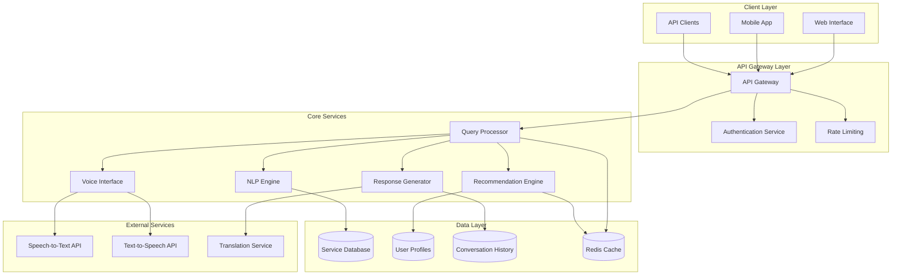

# Design Document: AI-Powered Community Helpdesk

## Overview

The AI-powered Community Helpdesk is a conversational system designed to bridge the accessibility gap between citizens and public services. The system employs a microservices architecture with specialized components for natural language processing, multilingual support, voice interaction, and personalized recommendations. The design prioritizes accessibility, scalability, and cultural sensitivity while maintaining data privacy and security.

The system follows a modular architecture where each component can be independently scaled and updated. The core conversation flow processes user queries through multiple stages: input processing (text/voice), intent recognition, context management, response generation, and output delivery (text/voice). This design ensures consistent user experience across different interaction modalities while supporting diverse user needs and technical capabilities.

## Architecture

The system employs a distributed microservices architecture with the following key architectural patterns:

### High-Level Architecture



### Architectural Principles

**Microservices Design**: Each major component operates as an independent service with well-defined APIs, enabling independent scaling and deployment. Services communicate through RESTful APIs and message queues for asynchronous processing.

**Event-Driven Architecture**: The system uses event-driven patterns for real-time updates, user notifications, and service information synchronization. This ensures loose coupling between services and supports reactive user experiences.

**API-First Design**: All functionality is exposed through well-documented APIs, enabling multiple client interfaces (web, mobile, third-party integrations) and future extensibility.

**Caching Strategy**: Multi-layer caching with Redis for frequently accessed service information, user profiles, and conversation context to ensure sub-3-second response times.

## Components and Interfaces

### Query Processor Service

The Query Processor serves as the central orchestrator for all user interactions, managing the complete conversation lifecycle from input reception to response delivery.

**Core Responsibilities:**
- Receives and validates user input from multiple channels (text, voice, API)
- Maintains conversation context and session state
- Orchestrates calls to specialized services (NLP, Voice, Recommendations)
- Implements conversation flow logic and error handling
- Manages response formatting and delivery

**Key Interfaces:**
```
POST /api/v1/query
- Input: { text?: string, audio?: base64, userId?: string, sessionId: string, language: string }
- Output: { response: string, audio?: base64, suggestions: string[], sessionId: string }

GET /api/v1/conversation/{sessionId}
- Output: { messages: ConversationMessage[], context: ConversationContext }

POST /api/v1/conversation/{sessionId}/feedback
- Input: { messageId: string, rating: number, feedback?: string }
```

### NLP Engine Service

The NLP Engine provides sophisticated natural language understanding capabilities, handling intent recognition, entity extraction, and context analysis across multiple languages.

**Core Capabilities:**
- Intent classification using transformer-based models fine-tuned for public service domains
- Named entity recognition for extracting relevant information (locations, dates, service types)
- Sentiment analysis for understanding user urgency and emotional state
- Context-aware processing that maintains conversation history
- Multilingual processing with language detection and cross-lingual understanding

**Key Interfaces:**
```
POST /api/v1/nlp/analyze
- Input: { text: string, language: string, context?: ConversationContext }
- Output: { intent: Intent, entities: Entity[], sentiment: Sentiment, confidence: number }

POST /api/v1/nlp/extract-entities
- Input: { text: string, language: string, entityTypes: string[] }
- Output: { entities: Entity[], confidence: number }
```

### Voice Interface Service

The Voice Interface Service manages all speech-related functionality, providing seamless voice interaction capabilities for users with varying literacy levels.

**Core Features:**
- Real-time speech-to-text conversion with noise reduction and accent adaptation
- Natural text-to-speech synthesis with regional accent support
- Voice activity detection and automatic speech segmentation
- Audio quality optimization for different network conditions
- Support for voice commands and navigation

**Integration Architecture:**
The service integrates with external STT/TTS providers through a provider abstraction layer, allowing for easy switching between services (Google Cloud Speech, Azure Cognitive Services, AWS Transcribe) based on language support and quality requirements.

**Key Interfaces:**
```
POST /api/v1/voice/transcribe
- Input: { audio: base64, language: string, userId?: string }
- Output: { text: string, confidence: number, language: string }

POST /api/v1/voice/synthesize
- Input: { text: string, language: string, voice?: string, speed?: number }
- Output: { audio: base64, duration: number }
```

### Recommendation Engine Service

The Recommendation Engine provides personalized service suggestions based on user profiles, eligibility criteria, and contextual factors.

**Recommendation Logic:**
- Rule-based eligibility matching using demographic and geographic criteria
- Priority scoring based on application deadlines, benefit amounts, and user preferences
- Contextual recommendations based on current conversation topics
- Proactive notifications for new services and deadline reminders

**Key Interfaces:**
```
POST /api/v1/recommendations/get
- Input: { userId?: string, userProfile?: UserProfile, context?: string }
- Output: { recommendations: ServiceRecommendation[], reasoning: string[] }

POST /api/v1/recommendations/feedback
- Input: { userId: string, serviceId: string, action: string, helpful: boolean }
```

### Response Generator Service

The Response Generator creates contextually appropriate, culturally sensitive responses in the user's preferred language and communication style.

**Response Generation Strategy:**
- Template-based responses for common queries with dynamic content insertion
- AI-generated responses for complex or unique queries using fine-tuned language models
- Cultural adaptation ensuring responses respect local customs and communication patterns
- Accessibility-optimized formatting for screen readers and assistive technologies

**Key Interfaces:**
```
POST /api/v1/response/generate
- Input: { intent: Intent, entities: Entity[], userProfile?: UserProfile, language: string }
- Output: { response: string, alternatives: string[], confidence: number }

POST /api/v1/response/translate
- Input: { text: string, fromLanguage: string, toLanguage: string }
- Output: { translatedText: string, confidence: number }
```

## Data Models

### User Profile Model
```typescript
interface UserProfile {
  userId: string;
  demographics: {
    ageGroup: 'student' | 'working' | 'senior' | 'other';
    location: {
      state: string;
      district: string;
      pincode?: string;
    };
    incomeCategory: 'bpl' | 'apl' | 'middle' | 'not_specified';
    occupation?: string;
    education?: string;
  };
  preferences: {
    language: string;
    communicationStyle: 'simple' | 'detailed' | 'technical';
    accessibilityNeeds: string[];
    notificationPreferences: NotificationSettings;
  };
  serviceHistory: ServiceInteraction[];
  createdAt: Date;
  updatedAt: Date;
}
```

### Service Information Model
```typescript
interface ServiceInformation {
  serviceId: string;
  name: string;
  description: string;
  category: string;
  eligibilityCriteria: EligibilityCriteria;
  requiredDocuments: Document[];
  applicationProcess: ProcessStep[];
  deadlines: {
    applicationDeadline?: Date;
    renewalDeadline?: Date;
  };
  contactInformation: ContactInfo;
  multilingual: {
    [languageCode: string]: ServiceTranslation;
  };
  lastUpdated: Date;
  source: string;
  verified: boolean;
}
```

### Conversation Context Model
```typescript
interface ConversationContext {
  sessionId: string;
  userId?: string;
  language: string;
  currentTopic?: string;
  extractedEntities: Entity[];
  conversationHistory: ConversationMessage[];
  userIntent: Intent[];
  pendingActions: PendingAction[];
  accessibilityMode?: AccessibilitySettings;
  createdAt: Date;
  lastActivity: Date;
}
```

### Intent and Entity Models
```typescript
interface Intent {
  name: string;
  confidence: number;
  parameters: { [key: string]: any };
  category: 'information' | 'application' | 'emergency' | 'navigation';
}

interface Entity {
  type: string;
  value: string;
  confidence: number;
  startIndex: number;
  endIndex: number;
  metadata?: { [key: string]: any };
}
```

Now I need to use the prework tool to analyze the acceptance criteria before writing the Correctness Properties section.

<function_calls>
<invoke name="prework">
<parameter name="featureName">community-helpdesk

## Correctness Properties

*A property is a characteristic or behavior that should hold true across all valid executions of a system—essentially, a formal statement about what the system should do. Properties serve as the bridge between human-readable specifications and machine-verifiable correctness guarantees.*

Based on the prework analysis of acceptance criteria, the following correctness properties ensure the system meets its functional requirements:

### Natural Language Processing Properties

**Property 1: Intent and Entity Extraction**
*For any* natural language query in a supported language, the Query_Processor should correctly identify at least one valid intent and extract all relevant entities with confidence scores above the minimum threshold.
**Validates: Requirements 1.1**

**Property 2: Multi-Request Query Handling**
*For any* query containing multiple distinct service requests, the Query_Processor should identify and separate each request, returning a list where each item corresponds to one distinct service request.
**Validates: Requirements 1.2**

**Property 3: Ambiguity Detection and Clarification**
*For any* ambiguous query (confidence score below threshold), the AI_Assistant should generate clarifying questions that help disambiguate the user's intent.
**Validates: Requirements 1.3**

**Property 4: Conversation Context Continuity**
*For any* conversation sequence, when a follow-up question is asked, the AI_Assistant should maintain and reference context from previous messages in the same session.
**Validates: Requirements 1.5**

### Multilingual Support Properties

**Property 5: Cross-Language Processing Consistency**
*For any* equivalent query expressed in different supported languages, the Query_Processor should extract the same intent and equivalent entities regardless of input language.
**Validates: Requirements 2.3**

**Property 6: Response Language Consistency**
*For any* user query, when a language preference is set, all system responses should be generated in that same language.
**Validates: Requirements 2.2**

**Property 7: Translation Terminology Consistency**
*For any* technical term or service name, the translation should be consistent across all supported languages and contexts within the system.
**Validates: Requirements 2.4**

### Voice Interface Properties

**Property 8: Speech Recognition Accuracy**
*For any* clear audio input in a supported language, the Voice_Interface should achieve at least 90% transcription accuracy when compared to human transcription.
**Validates: Requirements 3.1**

**Property 9: Text-to-Speech Language Matching**
*For any* text response, the Voice_Interface should generate speech audio in the same language as the input text with correct pronunciation and intonation patterns.
**Validates: Requirements 3.2**

**Property 10: Voice Recognition Error Handling**
*For any* voice input that fails recognition (confidence below threshold), the Voice_Interface should prompt the user to repeat or offer alternative input methods.
**Validates: Requirements 3.4**

**Property 11: Voice Command Recognition**
*For any* supported voice command, the Voice_Interface should correctly identify the command intent and trigger the appropriate system action.
**Validates: Requirements 3.5**

### Personalization and Recommendation Properties

**Property 12: Eligibility-Based Recommendations**
*For any* user profile and service database, the Recommendation_Engine should only suggest services where the user meets all eligibility criteria.
**Validates: Requirements 4.2**

**Property 13: Recommendation Prioritization**
*For any* set of eligible services for a user, recommendations should be ordered by relevance score and urgency (application deadlines), with higher scores and more urgent deadlines appearing first.
**Validates: Requirements 4.3**

**Property 14: Privacy-Preserving Recommendations**
*For any* user in privacy mode, the system should provide general recommendations without storing or accessing personal demographic data.
**Validates: Requirements 4.5**

### Application Guidance Properties

**Property 15: Complete Document Checklist**
*For any* service application request, the AI_Assistant should provide a checklist that includes all required documents as specified in the service database.
**Validates: Requirements 5.1**

**Property 16: Sequential Process Steps**
*For any* application process, the AI_Assistant should present steps in the correct sequential order as defined in the service database.
**Validates: Requirements 5.2**

**Property 17: Information Currency**
*For any* service information request, when service requirements have been updated in the database, users should receive the most current information available.
**Validates: Requirements 5.5**

### Emergency Response Properties

**Property 18: Emergency Query Prioritization**
*For any* query classified as emergency-related, the AI_Assistant should provide emergency contact information and procedures before any other response content.
**Validates: Requirements 6.3**

**Property 19: Location-Based Emergency Contacts**
*For any* emergency query with user location data, the AI_Assistant should provide both national emergency contacts and local contacts specific to the user's geographic area.
**Validates: Requirements 6.4**

### Accessibility Properties

**Property 20: Screen Reader Compatibility**
*For any* interface element, when screen reader mode is enabled, the Accessibility_Module should provide descriptive text that accurately describes the element's purpose and state.
**Validates: Requirements 7.2**

**Property 21: Keyboard Navigation Completeness**
*For any* system function, it should be accessible and operable using only keyboard input without requiring mouse interaction.
**Validates: Requirements 7.3**

**Property 22: Alternative Text Provision**
*For any* visual content presented to users, the AI_Assistant should include alternative text descriptions that convey the same information to users with visual impairments.
**Validates: Requirements 7.5**

### Data Management Properties

**Property 23: Service Information Completeness**
*For any* service record in the database, it should contain all required fields: eligibility criteria, required documents, application procedures, and contact information.
**Validates: Requirements 9.1**

**Property 24: Data Update Timeliness**
*For any* service information change notification, the Service_Database should be updated within 24 hours of receiving official notification.
**Validates: Requirements 9.2**

**Property 25: Source Prioritization**
*For any* information conflict between sources, the system should prioritize and display information from official government sources over secondary sources.
**Validates: Requirements 9.5**

### Privacy and Security Properties

**Property 26: Data Deletion Completeness**
*For any* user data deletion request, all personal data and conversation history associated with that user should be completely removed from all system databases and caches.
**Validates: Requirements 8.3**

**Property 27: Consent-Based Data Sharing**
*For any* request to share user data with third parties, the system should only proceed if explicit user consent has been obtained and recorded.
**Validates: Requirements 8.4**

### Performance Properties

**Property 28: Response Time Performance**
*For any* user query under normal load conditions, the system should generate and deliver a response within 3 seconds of receiving the query.
**Validates: Requirements 10.1**

**Property 29: Concurrent User Capacity**
*For any* system load up to 1000 concurrent users, response times and system functionality should remain within acceptable performance parameters.
**Validates: Requirements 10.4**

**Property 30: Auto-Scaling Behavior**
*For any* increase in system load beyond normal capacity, resources should automatically scale to maintain performance within acceptable limits.
**Validates: Requirements 10.3**

## Error Handling

The system implements comprehensive error handling across all components to ensure graceful degradation and user-friendly error recovery:

### Input Processing Errors
- **Malformed Queries**: When queries cannot be parsed, the system provides helpful suggestions for rephrasing
- **Unsupported Languages**: Clear messaging when users attempt to use unsupported languages, with suggestions for alternatives
- **Audio Quality Issues**: Voice interface provides feedback on audio quality and suggests improvements

### Service Integration Errors
- **External API Failures**: Fallback mechanisms for STT/TTS services with graceful degradation to text-only mode
- **Database Connectivity**: Cached responses and offline mode capabilities for common queries
- **Translation Service Outages**: Fallback to cached translations or simplified English responses

### User Experience Errors
- **Session Timeouts**: Automatic session recovery with context preservation
- **Accessibility Failures**: Alternative interaction methods when primary accessibility features fail
- **Network Connectivity**: Offline mode with cached service information and sync when connectivity returns

### Data Consistency Errors
- **Information Conflicts**: Clear indication when information sources conflict, with preference for official sources
- **Outdated Information**: Warnings when service information hasn't been updated recently
- **Missing Information**: Clear indication of incomplete data with suggestions for alternative sources

## Testing Strategy

The testing strategy employs a dual approach combining unit testing for specific scenarios and property-based testing for comprehensive validation:

### Unit Testing Approach
Unit tests focus on specific examples, edge cases, and integration points:
- **API Endpoint Testing**: Verify correct request/response handling for all service endpoints
- **Error Condition Testing**: Test specific error scenarios and recovery mechanisms
- **Integration Testing**: Verify correct interaction between microservices
- **Accessibility Testing**: Automated WCAG 2.1 AA compliance verification using tools like axe-core
- **Security Testing**: Verify encryption, authentication, and authorization mechanisms

### Property-Based Testing Configuration
Property-based tests validate universal properties across randomized inputs using **Hypothesis** (Python) or **fast-check** (JavaScript/TypeScript):

- **Minimum 100 iterations** per property test to ensure comprehensive input coverage
- **Custom generators** for domain-specific data (user profiles, service information, multilingual text)
- **Shrinking strategies** to identify minimal failing examples when properties fail
- **Test tagging** format: **Feature: community-helpdesk, Property {number}: {property_text}**

### Testing Coverage Requirements
- **Functional Coverage**: All acceptance criteria covered by corresponding properties
- **Language Coverage**: Testing across all supported languages with representative datasets
- **Accessibility Coverage**: Testing with screen readers, keyboard navigation, and assistive technologies
- **Performance Coverage**: Load testing with realistic user patterns and data volumes
- **Security Coverage**: Penetration testing and vulnerability assessment

### Continuous Testing Integration
- **Automated Test Execution**: All tests run on every code change with fast feedback
- **Property Test Monitoring**: Long-running property tests to catch rare edge cases
- **Accessibility Regression Testing**: Automated accessibility testing in CI/CD pipeline
- **Performance Regression Testing**: Automated performance benchmarking with alerting

The testing strategy ensures that both specific use cases and general system behaviors are thoroughly validated, providing confidence in system correctness and reliability across diverse user scenarios and input conditions.
